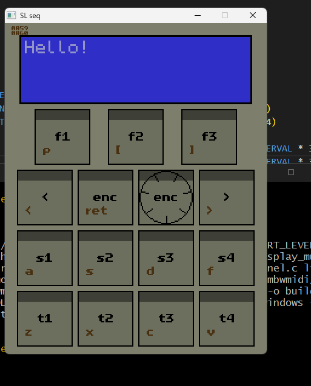

# SDL2 hardware emulator

Cross platform project for experimenting with different MIDI control panel layouts, sequencing and audio synthesis. An attempt has been made to make the control as convenient as possible on a computer. Simultaneous input from the keyboard, mouse or multi-touch panel is supported.Compatible with Arduino MIDI over serial.

Tested in Linux and MINGW64.

The idea is to have Arduino-like simplicity in building control surface in pure c. All actual panel code located in `user/` folder by default. You can change it by `make DIR_USER=my_superbest_panel`. There are basically only 2 callbacks:
- `void panelConstruct(SDL_Renderer* rend)` - in which you must init various widgets you need on your surface
- `void panelLoop(uint32_t clock)` - in which you must handle those widgets (the application part), perform midi processing and routing and other logic you need
- `void panelProcessAudio(*in, *out)` - TBD

## widgets
All widgets generates events in form of midi messages. You can differentiate them by CN (cable number) field in message structure (for details see my mbwmidi library and USB MIDI class specs). All widgets have leds (RGB). For the displays led acts as a backlight color.
- Button - can be pressed by the mouse or keyboard. Will generate events on press and release
- Encoder - can be turned by the mouse drag, scroll wheels, or 2 keyboard keys for inc and dec. Will generate events with relative signed values depending on the travel distance.
- Pot - emulation of the common microcontroller potentiometer + ADC circuit, will generate high resolution midi values with some noise. can be dragged by mouse or by scroll wheels. Can be locked in case of function or patch change (part of mbwmidi library).
- Displays. They are not generate any events. Dedicated api will be created for each defined instance. Graphic ones based on minimalgraphics library. You can press on the display to make a screenshot.
    - character - standart 1602 type with cgram.
    - mono - graphic lcd or oled
    - multi - tft or 4bit oled (by default RGB565 noise is added)
- midi - !only one instance can be used! portmidi and libserialport connection to outside. It displays number of received and sent messages and can be clicked for reinit connection (if you unplug your USB-MIDI device, it can not be seen by sw). You need to specify names of the input and output devices you wanna to use. Only part of the string is enough. I plan to put that in some text configuration file, but at the moment it should be hardcoded. You also need to specify baudrates:
    - For serial devices an actual port setting should be specified (i.e. 9600 or 115200 or 31250..)
    - For both midi and serial devices flow limiter value should be specified (virtual baud). You are free to experiment with different rates. For example, if you are using some old synths, you can lower the baud from 31250 to 10000 or even less. Minimal virtual baud is 10 bits per second.
Should be compatible with Arduino MIDI over serial.
- audio - based on portaudio library. In case you want to experiment with synthesis. It can be initialized with NULL instead of device names to select default devices. Portaudio callback for each audio connection should be created using `WID_AUDIO_CALLBACK_DEFINE` macro. When creating it, you need to specify the name of the callback to be created, which will be used when creating the widget, as well as the block handling method it will call. At the moment the call is made from portaudio library, so all thread safety is on you. I am thinking about calling it from widget process, but it will cause additional latency.
- eeprom - not a widget, just bsp read and write methods, which is about the same as what you probably get on hw. You may have multiple chips, so make sure you select the one with `void eepromSelect(const GadgetEeprom* const e)` before calling read or write. **!! The file name must not contain folders !!**

## future widgets
- file - in case you want to experiment with patches or audio samples

# dependencies:
- `mbwmidi` and `minimalgraphics` libraries. this is the main interface between hw and application.
- make, gcc, pkgconf
- SDL2, portmidi, libserialport, portaudio (probably with -dev suffix, TODO check on linux)
- and do not forget to `git submodule update --init --recursive` if you want to build demo projects from this repo

# integration:
To use the emulator in your project, add the `src` folder to build (.c files) and include (.h files). Your project should also contain the `mbwmidi` and `minimalgraphics` libraries, but their `-conf.h` files should be used from the `src` folder! It is recommended to use `#include "panel.h"` in your files.

All interactions are done via MIDI events. Each event has a 4-bit `cn` field (cable number) in addition to the midi bytes to be able to determine the source of this message. Accordingly, a project can have up to 16 midi sources. Sources can be defined in `panel_conf.h` and when defining and initializing midi widgets. Control of LEDs and potentiometers (and even a character display) can also be done using midi messages for ease of porting and potential remote operation. A simple solution would be a callback like `void panelHandleMidi(MidiMessageT m)`, but this is up to you.

# TODO:
- primary:
    - portaudio watchdog for restarting on critical drops.
        - Reaktor-like switch?
    - makefile to split build process
        - integration process with instruction
    - COORDINATES AND SCALES ARE MESS
- secondary
    - does audio work in a systems with no input(output) devices?
    - performance analysis (?)
    - filesystem integration (?)
    - encoder press (if distance < thrsh on mouse release)?
    - multiple keyboard keys for one element
    - additional configs load (midi ports and audio selection, color scheme, size/scale?)
        - runtme panel init from config (simplified functionality) ?
    - always on top switch?
    - multiple midi IO
        - within one or multiple widgets?
        - separate serial and midi
    - audio SRC for weird samplerates (arbitraty between 10k and 384k)
    - cmake?
    - SDL_WaitEvent without vsync? for variable framerate and mainloop rate
